# SenseAR Effects iOS集成文档

## 目录
### 1.集成准备
1.1 导入库文件
1.2 添加链接库
1.3 关闭Bitcode
1.4 导入头文件

### 2.SDK授权
2.1 License授权
2.2 离线鉴权
### 3.SDK各接口 的使用
3.1 人脸检测功能
3.2 人脸属性功能
3.3 猫脸检测功能
3.4 特效(美颜、美妆、贴纸、滤镜)功能
3.5 通用物体跟踪功能
3.6 Try On功能
3.7 3D微整形功能

### 4.纹理介绍
4.1 从Camera获取纹理
4.2 纹理预处理
4.3 纹理渲染

### 5.集成注意事项
### 6.检测渲染优化
### 7.参考demo快速集成
7.1 创建一个空项目
7.2 拷贝必要文件
7.3 在项目中导入真机库和动态库
7.4 导入辅助文件
7.5 开始集成


## 1 集成准备
### 1.1 导入库文件
导入 SenseME Effects iOS SDK 头文件、静态库文件(.a)（如下图所示）


由于新版本Effects增加了在线鉴权以及在线素材拉取功能，因此需要导入相关静态库以及头文件，如下图所示


### 1.2 添加链接库
SenseME Effects依赖c++，从TARGETS -> Build Settings -> Linking -> Other LinkerFlags添加-lc++
### 1.3 关闭Bitcode
SenseMe Effects不支持Bitcode，从TARGETS -> Build Settings -> Build Options -> Enable Bitcode 设置为 NO
### 1.4 导入头文件
按需要导入所需头文件

```
#import "st_mobile_effect.h"
#import "st_mobile_license.h"
#import "SenseArSourceService.h" 
```

## 2 SDK授权
### 2.1 License授权
1.SDK需要检查算法库的使用权限，只有通过了鉴权，SDK的功能才能够正常使用。
2.鉴权方式分为在线鉴权以及离线鉴权，在线鉴权需要获取托管在服务器的license数据，离线鉴权使用本地license检测即可。
### 2.2 离线鉴权
(1)读取本地license文件内容
(2)获取本地保存的激活码
(3)如果没有则生成一个激活码
(4)如果有, 则直接调用checkActiveCode*检查激活码
(5)如果检查失败，则重新生成一个activeCode
(6)如果生成失败，则返回失败，成功则保存新的activeCode，并返回成功
```objc
//读取SenseME.lic文件内容
NSString *strLicensePath = [[NSBundle mainBundle] pathForResource:@"SENSEME" ofType:@"lic"];
NSData *dataLicense = [NSData dataWithContentsOfFile:strLicensePath];
NSString *strKeySHA1 = @"SENSEME";
NSString *strKeyActiveCode = @"ACTIVE_CODE";
NSUserDefaults *userDefaults = [NSUserDefaults standardUserDefaults];
NSString *strStoredSHA1 = [userDefaults objectForKey:strKeySHA1];
NSString *strLicenseSHA1 = [self getSHA1StringWithData:dataLicense];
... ...

//检查当前的激活吗是否可用(这里提供两种方法)
//use file
iRet = st_mobile_check_activecode( strLicensePath.UTF8String,(const char *)[activeCodeData bytes]);
//use buffer
NSData *licenseData = [NSData dataWithContentsOfFile:strLicensePath];
iRet = st_mobile_check_activecode_from_buffer(
[licenseData bytes],
(int)[licenseData length],
[activeCodeData bytes]
);

//如果检查失败，重新生成一个，并更新本地激活码，同理我们提供了两种方法
// use file
iRet = st_mobile_generate_activecode(
strLicensePath.UTF8String,
active_code,
&active_code_len
);
// use buffer
NSData *licenseData = [NSData dataWithContentsOfFile:strLicensePath];
iRet = st_mobile_generate_activecode_from_buffer(
[licenseData bytes],
(int)[licenseData length],
active_code,
&active_code_len
);
//更新本地已有active Code
NSData *activeCodeData = [NSData dataWithBytes:active_code length:active_code_len];
[userDefaults setObject:activeCodeData forKey:strKeyActiveCode];
[userDefaults setObject:strLicenseSHA1 forKey:strKeySHA1];
[userDefaults synchronize];
```

## 3 SDK各接口的使用
### 3.1 人脸检测功能
#### 3.1.1 HumanAction句柄初始化

```
//HumanAction句柄初始化
//创建humanAction句柄
//说明：该接口提供两种创建人体行为的句柄方式，检测视频时设置为ST_MOBILE_HUMAN_ACTION_DEFAULT_CONFIG_VIDEO,检测图片时设置为ST_MOBILE_HUMAN_ACTION_DEFAULT_CONFIG_IMAGE,具体配置在st_mobile_human_action.h头文件。此处注意区分创建句柄是的config和进行human action检测时的config，只有在创建句柄时配置了相关config，进行human action时的config才会生效。
iRet = st_mobile_human_action_create(NULL, config, &_hDetectorHandle);

//加载子模型,可以调用st_mobile_human_action_add_sub_model.
NSString *strEyeCenter = [[NSBundle mainBundle]pathForResource:@"xx" ofType:@"model"];
iRet = st_mobile_human_action_add_sub_model(_hDetector, strEyeCenter.UTF8String);

//设置human action参数,此处设置手势2帧检测一次，可根据需要进行设置。
//其余可以设置的参数可参考st_mobile_human_action.h头文件。
iRet = st_mobile_human_action_setparam(_hDetector,ST_HUMAN_ACTION_PARAM_HAND_PROCESS_INTERVAL, 2);
```

#### 3.1.2 开始检测
```objc
//检测人脸关键点，脸部动作、表情，手势，前后背景分割，肢体及肢体动作，需要通过cofig进行配置
//只有配置了对应的config，检测结果中才会有相应数据
//检测结果的结构定义在st_mobile_human_action.h中，具体使用参考sample

iRet = st_mobile_human_action_detect(_hDetectorHandle,  //人脸检测句柄
                                     pBGRAImageIn,      //输出数据地址
                                     ST_PIX_FMT_BGRA8888,//图像格式
                                     iWidth,            //宽
                                     iHeight,           //高
                                     iBytesPerRow,      //iWidth * 4(4通道bgra)
                                     stMobileRotate,    //旋转角度
                                     iConfig,           //动作检测
                                     &detectResult      //检测结果
                                    );

//各个参数的获取方式
可以直接从接口中直接获取config：
uint64_t iConfig = 0;
st_mobile_effect_get_detect_config(_hEffectHandle, &config);

//初始化检测结果结构体，SDK会对数据进行操作，提供后续后续处理使用。
st_mobile_human_action_t detectResult = {};
memset(&detectResult, 0, sizeof(st_mobile_human_action_t));

//获取手机旋转角度
旋转角度含义：拿一张照片对照着手机进行旋转，看看旋转到哪个方向能检测到人脸，此角就是人脸检测的设置角度，详见enum：
typedef enum {
    ST_CLOCKWISE_ROTATE_0 = 0,  ///< 图像不需要旋转,图像中的人脸为正脸
    ST_CLOCKWISE_ROTATE_90 = 1, ///< 图像需要顺时针旋转90度,使图像中的人脸为正
    ST_CLOCKWISE_ROTATE_180 = 2,///< 图像需要顺时针旋转180度,使图像中的人脸为正
    ST_CLOCKWISE_ROTATE_270 = 3 ///< 图像需要顺时针旋转270度,使图像中的人脸为正
} st_rotate_type;

- (st_rotate_type)getRotateType{
    BOOL isFrontCamera = self.stCamera.devicePosition == AVCaptureDevicePositionFront;
    BOOL isVideoMirrored = self.stCamera.videoConnection.isVideoMirrored;
    
    [self getDeviceOrientation:self.motionManager.accelerometerData];
    
    switch (_deviceOrientation) {//当前手机的旋转方向
        case UIDeviceOrientationPortrait:
            return ST_CLOCKWISE_ROTATE_0;
        case UIDeviceOrientationPortraitUpsideDown:
            return ST_CLOCKWISE_ROTATE_180;
        case UIDeviceOrientationLandscapeLeft:
            return ((isFrontCamera && isVideoMirrored) || (!isFrontCamera && !isVideoMirrored)) ? ST_CLOCKWISE_ROTATE_270 : ST_CLOCKWISE_ROTATE_90;
        case UIDeviceOrientationLandscapeRight:
            return ((isFrontCamera && isVideoMirrored) || (!isFrontCamera && !isVideoMirrored)) ? ST_CLOCKWISE_ROTATE_90 : ST_CLOCKWISE_ROTATE_270;
        default:
            return ST_CLOCKWISE_ROTATE_0;
    }
}
方法的具体实现可在demo中获取

st_rorate_type stMobileRotate = [self getRotateType];
```

#### 3.1.3 人脸检测句柄的销毁
```
//释放人脸检测句柄
if (_hEffectHandle) {
    st_mobile_human_action_destroy(_hDetectorHandle);
    _hEffectHandle = NULL;
}
```

### 3.2 人脸属性功能
#### 3.2.1 人脸属性句柄创建

```objc
//face attribute句柄初始化
//获取人脸属性模型路径
NSString *strAttriModelPath = [[NSBundle mainBundle] pathForResource:@"M_SenseME_Attribute_1.0.1" ofType:@"model"];
//创建人脸属性句柄
iRet = st_mobile_face_attribute_create(strAttriModelPath.UTF8String, &_hAttributeHandle);
```

#### 3.2.2 人脸属性检测

```objc
//检测人脸关键点，脸部动作、表情，手势，前后背景分割，肢体及肢体动作，需要通过cofig进行配置
//只有配置了对应的config，检测结果中才会有相应数据
//检测结果的结构定义在st_mobile_human_action.h中，具体使用参考sample
iRet = st_mobile_human_action_detect(_hDetector,//人脸检测句柄
                                     pBGRAImageIn,//输出数据地址
                                     ST_PIX_FMT_BGRA8888,//图像格式
                                     iWidth,//宽
                                     iHeight,//高
                                     iBytesPerRow,//iWidth * 4(4通道bgra)
                                     stMobileRotate,//旋转角度
                                     iConfig,//动作检测
                                     &detectResult//检测结果
                                    );
旋转角度含义：拿一张照片对照着手机进行旋转，看看旋转到哪个方向能检测到人脸，此角就是人脸检测的设置角度，详见enum：
typedef enum {
ST_CLOCKWISE_ROTATE_0 = 0,  ///< 图像不需要旋转,图像中的人脸为正脸
ST_CLOCKWISE_ROTATE_90 = 1, ///< 图像需要顺时针旋转90度,使图像中的人脸为正
ST_CLOCKWISE_ROTATE_180 = 2,///< 图像需要顺时针旋转180度,使图像中的人脸为正
ST_CLOCKWISE_ROTATE_270 = 3 ///< 图像需要顺时针旋转270度,使图像中的人脸为正
} st_rotate_type;
```
expression接口使用
该接口需要使用human action detect的结果因此，需要在detect之后调用，使用方法如下：
```
//expression检测结果，每个元素代表的表情定义在ST_MOBILE_EXPRESSION枚举中
bool expressionResult[128] = {0};
st_result_t iRet = st_mobile_get_expression(&detectResult, stMobileRotate, NO, expressionResult);

//设置expression阈值,推荐使用默认阈值,无需手动设置
iRet = st_mobile_set_expression_threshold(ST_MOBILE_EXPRESSION_HEAD_NORMAL, 0.5);
```
人脸属性接口的使用。FaceAttribute接口的输入参数依赖于HumanAction参数的输出，也就是说运行人脸属性之前需要先做HumanAction：
```
iRet = st_mobile_face_attribute_detect(_hAttribute,
                                        pBGRAImageIn,
                                        ST_PIX_FMT_BGRA8888,
                                        iWidth,
                                        iHeight,
                                        iBytesPerRow,
                                        _pFacesDetection,
                                        1, // 这里仅取一张脸也就是第一张脸的属性作为演示
                                        &pAttrArray);
```

#### 3.2.3 人脸属性句柄销毁
```
//释放人脸属性句柄
if (_hAttributeHandle) {
    st_mobile_face_attribute_destroy(_hAttributeHandle);
    _hAttributeHandle = NULL;
}
```
### 3.3 猫脸、狗脸检测功能
#### 3.3.1 句柄创建
```objc
//获取猫脸检测模型路径
NSString *catFaceModelPath = [[NSBundle mainBundle] pathForResource:@"M_SenseME_CatFace_3.0.0" ofType:@"model"];
NSString *dogFaceModelPath = [[NSBundle mainBundle] pathForResource:@"M_SenseME_DogFace_2.0.0" ofType:@"model"];
//创建猫脸检测句柄
int config = ST_MOBILE_TRACKING_MULTI_THREAD;
switch (type) {
    case EffectsTypePhoto:
        config = ST_MOBILE_DETECT_MODE_IMAGE;
        break;
        
    case EffectsTypeVideo:
        config = ST_MOBILE_TRACKING_SINGLE_THREAD;
        break;
        
    default:
        break;
}

st_result_t ret = st_mobile_tracker_animal_face_create(catFaceModelPath.UTF8String,
                                                       config,
                                                       &_hAnimalHandle);
if (ret != ST_OK) {
    NSLog(@"st_mobile_tracker_animal_face_create error %d", ret);
}
ret = st_mobile_tracker_animal_face_add_sub_model(_hAnimalHandle, dogFaceModelPath.UTF8String);
if (ret != ST_OK) {
    NSLog(@"st_mobile_tracker_animal_face_add_sub_model error %d", ret);
}
```

#### 3.3.2 检测
```
st_mobile_animal_face_t *animal_result;
int animal_count;
st_result_t iRet = st_mobile_tracker_animal_face_track(_hAnimalHandle,
                                                        imageData,
                                                        ST_PIX_FMT_BGRA8888,
                                                        width,
                                                        height,
                                                        bytesPerRow,
                                                        rotate,
                                                        &animal_result,
                                                        &animal_count));
```

#### 3.3.3 句柄销毁
```
if (_hAnimalHandle) {
    st_mobile_tracker_animal_face_destroy(_hAnimalHandle);
    _hAnimalHandle = NULL;
}
```

### 3.4 特效(美颜、美妆、贴纸、滤镜)功能
#### 3.4.1 特效句柄创建
```objc
//当处理连续的图像数据是使用默认配置 EFFECT_CONFIG_NONE
iRet = st_mobile_effect_create_handle(EFFECT_CONFIG_NONE, &_hEffectHandle);
//当处理单独一帧图像数据数据时使用 EFFECT_CONFIG_IMAGE_MODE
iRet = st_mobile_effect_create_handle(EFFECT_CONFIG_IMAGE_MODE, &_hEffectHandle);
```

#### 3.4.2 设置美颜参数
```objc
//特效句柄创建成功后，可以设置美颜相关参数
// 设置美白1, [0,1.0], 默认值0.30, 0.0不做美白
st_mobile_effect_set_beauty_mode(_hEffectHandle, EFFECT_BEAUTY_BASE_WHITTEN, 0);
st_mobile_effect_set_beauty_strength(_hEffectHandle, EFFECT_BEAUTY_BASE_WHITTEN, value);

// 设置美白2, [0,1.0], 默认值0.30, 0.0不做美白
st_mobile_effect_set_beauty_mode(_hEffectHandle, EFFECT_BEAUTY_BASE_WHITTEN, 2);
st_mobile_effect_set_beauty_strength(_hEffectHandle, EFFECT_BEAUTY_BASE_WHITTEN, value);

// 设置美白3, [0,1.0], 默认值0.30, 0.0不做美白 
// 注意在设置美白3的时候，需要加载颜色资源文件，需要在OpenGL环境当中
st_mobile_effect_set_beauty_mode(_hEffectHandle, EFFECT_BEAUTY_BASE_WHITTEN, 3);
if ([EAGLContext currentContext] != self.glContext) {
    [EAGLContext setCurrentContext:self.glContext];
}
NSString *path = [[NSBundle mainBundle] pathForResource:@"whiten_gif" ofType:@"zip"];
st_mobile_effect_set_beauty(_hEffectHandle, EFFECT_BEAUTY_BASE_WHITTEN, path);
st_mobile_effect_set_beauty_strength(_hEffectHandle, EFFECT_BEAUTY_BASE_WHITTEN, value);
```
* 注意美白1，2，3同时只能一种效果有效，在使用时注意区分，具体使用方法可查看分Demo有关这块的描述


```
// 设置磨皮1, 范围[0,1.0], 默认值0.74, 0.0不做磨皮
st_mobile_effect_set_beauty_mode(_hEffectHandle, EFFECT_BEAUTY_BASE_FACE_SMOOTH, 1);
st_mobile_effect_set_beauty_strength(_hEffectHandle, EFFECT_BEAUTY_BASE_FACE_SMOOTH, value);

// 设置磨皮2, 范围[0,1.0], 默认值0.74, 0.0不做磨皮
st_mobile_effect_set_beauty_mode(_hEffectHandle, EFFECT_BEAUTY_BASE_FACE_SMOOTH, 2);
st_mobile_effect_set_beauty_strength(_hEffectHandle, EFFECT_BEAUTY_BASE_FACE_SMOOTH, value);
```
* 注意磨皮1，2同时也只能有一种设置有效，在使用时注意区分，具体使用方法可查看分Demo有关这块的描述
```
// 设置默认红润参数, 范围[0,1.0], 默认值0.36, 0.0不做红润
st_mobile_effect_set_beauty_strength(_hEffectHandle, EFFECT_BEAUTY_BASE_REDDEN, value);

// 设置默认瘦脸参数, 范围[0,1.0], 默认值0.11, 0.0不做瘦脸效果
st_mobile_effect_set_beauty_strength(_hEffectHandle, EFFECT_BEAUTY_RESHAPE_SHRINK_FACE, value);

// 设置默认大眼参数, 范围[0,1.0], 默认值0.13, 0.0不做大眼效果
st_mobile_effect_set_beauty_strength(_hEffectHandle, EFFECT_BEAUTY_RESHAPE_ENLARGE_EYE, value);

// 设置小脸参数, 范围[0,1.0], 默认值0.10, 0.0不做小脸效果
st_mobile_effect_set_beauty_strength(_hEffectHandle, EFFECT_BEAUTY_RESHAPE_SHRINK_JAW, value);

// 窄脸比例， [0,1.0], 默认值0.0, 0.0不做窄脸效果
st_mobile_effect_set_beauty_strength(_hEffectHandle, EFFECT_BEAUTY_RESHAPE_NARROW_FACE, value);

// 圆眼， [0,1.0], 默认值0.0, 0.0不做圆眼
st_mobile_effect_set_beauty_strength(_hEffectHandle, EFFECT_BEAUTY_RESHAPE_ROUND_EYE, value);

// 微整形 plastic
// 小头, [0, 1.0], 默认值0.0, 0.0不做小头效果
st_mobile_effect_set_beauty_strength(_hEffectHandle, EFFECT_BEAUTY_PLASTIC_THINNER_HEAD, value);

// 瘦脸型，[0,1.0], 默认值0.0, 0.0不做瘦脸型效果
st_mobile_effect_set_beauty_strength(_hEffectHandle, EFFECT_BEAUTY_PLASTIC_THIN_FACE, value);

// 下巴，[-1, 1], 默认值为0.0，[-1, 0]为短下巴，[0, 1]为长下巴
st_mobile_effect_set_beauty_strength(_hEffectHandle, EFFECT_BEAUTY_PLASTIC_CHIN_LENGTH, value);

// 额头，[-1, 1], 默认值为0.0，[-1, 0]为低发际线，[0, 1]为高发际线
st_mobile_effect_set_beauty_strength(_hEffectHandle, EFFECT_BEAUTY_PLASTIC_CHIN_LENGTH, value);
(_hEffectHandle, EFFECT_BEAUTY_PLASTIC_HAIRLINE_HEIGHT, value);

// 苹果肌，[0, 1.0]，默认值为0.0，0.0不做苹果肌
st_mobile_effect_set_beauty_strength(_hEffectHandle, EFFECT_BEAUTY_PLASTIC_CHIN_LENGTH, value);
(_hEffectHandle, EFFECT_BEAUTY_PLASTIC_APPLE_MUSLE, value);

// 瘦鼻翼，[0, 1.0], 默认值为0.0，0.0不做瘦鼻
st_mobile_effect_set_beauty_strength(_hEffectHandle, EFFECT_BEAUTY_PLASTIC_CHIN_LENGTH, value);
(_hEffectHandle, EFFECT_BEAUTY_PLASTIC_NARROW_NOSE, value);

// 长鼻，[-1, 1], 默认值为0.0, [-1, 0]为短鼻，[0, 1]为长鼻
st_mobile_effect_set_beauty_strength(_hEffectHandle, EFFECT_BEAUTY_PLASTIC_CHIN_LENGTH, value);
(_hEffectHandle, EFFECT_BEAUTY_PLASTIC_NOSE_LENGTH, value);

// 侧脸隆鼻，[0, 1.0]，默认值为0.0，0.0不做侧脸隆鼻效果
st_mobile_effect_set_beauty_strength(_hEffectHandle, EFFECT_BEAUTY_PLASTIC_CHIN_LENGTH, value);
(_hEffectHandle, EFFECT_BEAUTY_PLASTIC_PROFILE_RHINOPLASTY, value);

// 嘴型，[-1, 1]，默认值为0.0，[-1, 0]为放大嘴巴，[0, 1]为缩小嘴巴
st_mobile_effect_set_beauty_strength(_hEffectHandle, EFFECT_BEAUTY_PLASTIC_CHIN_LENGTH, value);
(_hEffectHandle, EFFECT_BEAUTY_PLASTIC_MOUTH_SIZE, value);

// 缩人中，[-1, 1], 默认值为0.0，[-1, 0]为长人中，[0, 1]为短人中
st_mobile_effect_set_beauty_strength(_hEffectHandle, EFFECT_BEAUTY_PLASTIC_CHIN_LENGTH, value);
(_hEffectHandle, EFFECT_BEAUTY_PLASTIC_PHILTRUM_LENGTH, value);

// 眼距，[-1, 1]，默认值为0.0，[-1, 0]为减小眼距，[0, 1]为增加眼距
st_mobile_effect_set_beauty_strength(_hEffectHandle, EFFECT_BEAUTY_PLASTIC_CHIN_LENGTH, value);
(_hEffectHandle, EFFECT_BEAUTY_PLASTIC_EYE_DISTANCE, value);

// 眼睛角度，[-1, 1]，默认值为0.0，[-1, 0]为左眼逆时针旋转，[0, 1]为左眼顺时针旋转，右眼与左眼相对
st_mobile_effect_set_beauty_strength(_hEffectHandle, EFFECT_BEAUTY_PLASTIC_CHIN_LENGTH, value);
(_hEffectHandle, EFFECT_BEAUTY_PLASTIC_EYE_ANGLE, value);

// 开眼角，[0, 1.0]，默认值为0.0， 0.0不做开眼角
st_mobile_effect_set_beauty_strength(_hEffectHandle, EFFECT_BEAUTY_PLASTIC_CHIN_LENGTH, value);
(_hEffectHandle, EFFECT_BEAUTY_PLASTIC_OPEN_CANTHUS, value);

// 亮眼，[0, 1.0]，默认值为0.0，0.0不做亮眼
st_mobile_effect_set_beauty_strength(_hEffectHandle, EFFECT_BEAUTY_PLASTIC_CHIN_LENGTH, value);
(_hEffectHandle, EFFECT_BEAUTY_PLASTIC_BRIGHT_EYE, value);

// 祛黑眼圈，[0, 1.0]，默认值为0.0，0.0不做去黑眼圈
st_mobile_effect_set_beauty_strength(_hEffectHandle, EFFECT_BEAUTY_PLASTIC_REMOVE_DARK_CIRCLES, value);

// 祛法令纹，[0, 1.0]，默认值为0.0，0.0不做去法令纹
st_mobile_effect_set_beauty_strength(_hEffectHandle, EFFECT_BEAUTY_PLASTIC_REMOVE_NASOLABIAL_FOLDS, value);

// 白牙，[0, 1.0]，默认值为0.0，0.0不做白牙
st_mobile_effect_set_beauty_strength(_hEffectHandle, EFFECT_BEAUTY_PLASTIC_WHITE_TEETH, value);

// 瘦颧骨， [0, 1.0], 默认值0.0， 0.0不做瘦颧骨
st_mobile_effect_set_beauty_strength(_hEffectHandle, EFFECT_BEAUTY_PLASTIC_SHRINK_CHEEKBONE, value);

// 开外眼角比例，[0, 1.0]，默认值为0.0， 0.0不做开外眼角
st_mobile_effect_set_beauty_strength(_hEffectHandle, EFFECT_BEAUTY_PLASTIC_OPEN_EXTERNAL_CANTHUS, value);

//设置对比度参数, 范围[0,1.0], 默认0.0
st_mobile_effect_set_beauty_strength(_hBeautify, EFFECT_BEAUTY_TONE_CONTRAST, value);

//设置饱和度参数, 范围[0,1.0], 默认0.0
st_mobile_effect_set_beauty_strength(_hBeautify, EFFECT_BEAUTY_TONE_SATURATION, value);

//锐化参数
st_mobile_effect_set_beauty_strength(_hBeautify, EFFECT_BEAUTY_TONE_SHARPEN, value);

//清晰度参数
st_mobile_effect_set_beauty_strength(_hBeautify, EFFECT_BEAUTY_TONE_CLEAR, value);

```

#### 3.4.2 设置美妆
```objc
//SDK美妆功能，该功能可设置参数如下：
//美妆使用方法分为2个步骤：
//1.设置美妆素材路径
//2.设置美妆强度

//染发
NSString *path = [[NSBundle mainBundle] pathForResource:@"xxx" ofType:@"zip"];
st_mobile_effect_set_beauty(_hEffectHandle, EFFECT_BEAUTY_MAKEUP_HAIR_DYE, path.UTF8String);
st_mobile_effect_set_beauty_strength(_hEffectHandle, EFFECT_BEAUTY_MAKEUP_HAIR_DYE, value);

//口红
NSString *path = [[NSBundle mainBundle] pathForResource:@"美妆" ofType:@"zip"];
st_mobile_effect_set_beauty(_hEffectHandle, EFFECT_BEAUTY_MAKEUP_LIP, path.UTF8String);
st_mobile_effect_set_beauty_strength(_hEffectHandle, EFFECT_BEAUTY_MAKEUP_LIP, value);

//腮红
NSString *path = [[NSBundle mainBundle] pathForResource:@"美妆" ofType:@"zip"];
st_mobile_effect_set_beauty(_hEffectHandle, EFFECT_BEAUTY_MAKEUP_CHEEK, path.UTF8String);
st_mobile_effect_set_beauty_strength(_hEffectHandle, EFFECT_BEAUTY_MAKEUP_CHEEK, value);

//修容
NSString *path = [[NSBundle mainBundle] pathForResource:@"美妆" ofType:@"zip"];
st_mobile_effect_set_beauty(_hEffectHandle, EFFECT_BEAUTY_MAKEUP_NOSE, path.UTF8String);
st_mobile_effect_set_beauty_strength(_hEffectHandle, EFFECT_BEAUTY_MAKEUP_NOSE, value);

//眉毛
NSString *path = [[NSBundle mainBundle] pathForResource:@"美妆" ofType:@"zip"];
st_mobile_effect_set_beauty(_hEffectHandle, EFFECT_BEAUTY_MAKEUP_EYE_BROW, path.UTF8String);
st_mobile_effect_set_beauty_strength(_hEffectHandle, EFFECT_BEAUTY_MAKEUP_EYE_BROW, value);

//眼影
NSString *path = [[NSBundle mainBundle] pathForResource:@"美妆" ofType:@"zip"];
st_mobile_effect_set_beauty(_hEffectHandle, EFFECT_BEAUTY_MAKEUP_EYE_SHADOW, path.UTF8String);
st_mobile_effect_set_beauty_strength(_hEffectHandle, EFFECT_BEAUTY_MAKEUP_EYE_SHADOW, value);

//眼线
NSString *path = [[NSBundle mainBundle] pathForResource:@"美妆" ofType:@"zip"];
st_mobile_effect_set_beauty(_hEffectHandle, EFFECT_BEAUTY_MAKEUP_EYE_LINE, path.UTF8String);
st_mobile_effect_set_beauty_strength(_hEffectHandle, EFFECT_BEAUTY_MAKEUP_EYE_LINE, value);

//眼睫毛
NSString *path = [[NSBundle mainBundle] pathForResource:@"美妆" ofType:@"zip"];
st_mobile_effect_set_beauty(_hEffectHandle, EFFECT_BEAUTY_MAKEUP_EYE_LASH, path.UTF8String);
st_mobile_effect_set_beauty_strength(_hEffectHandle, EFFECT_BEAUTY_MAKEUP_EYE_LASH, value);

//美瞳
NSString *path = [[NSBundle mainBundle] pathForResource:@"美妆" ofType:@"zip"];
st_mobile_effect_set_beauty(_hEffectHandle, EFFECT_BEAUTY_MAKEUP_EYE_BALL, path.UTF8String);
st_mobile_effect_set_beauty_strength(_hEffectHandle, EFFECT_BEAUTY_MAKEUP_EYE_BALL, value);

//打包的美妆素材，可能包含一到多个单独的美妆模块，另外，添加时会替换所有现有美妆
NSString *path = [[NSBundle mainBundle] pathForResource:@"美妆" ofType:@"zip"];
st_mobile_effect_set_beauty(_hEffectHandle, EFFECT_BEAUTY_MAKEUP_PACKED, path.UTF8String);
st_mobile_effect_set_beauty_strength(_hEffectHandle, EFFECT_BEAUTY_MAKEUP_PACKED, value);

```

#### 3.4.3.设置滤镜
```
NSString *path = [[NSBundle mainBundle] pathForResource:@"滤镜" ofType:@"zip"];
st_result_t iRet = st_mobile_effect_set_beauty(beautifyHandle, EFFECT_BEAUTY_FILTER, path.UTF8String);
iRet = st_mobile_effect_set_beauty_strength(beautifyHandle, EFFECT_BEAUTY_FILTER, value);
```


#### 3.4.4 设置贴纸

```objc

//设置贴纸播放状态改变的回调函数指针
iRet = st_mobile_effect_set_module_state_change_callback(_hEffectHandle, __module_state_change_callback);

//回调函数
st_result_t __module_state_change_callback(st_handle_t handle, const st_effect_module_info_t* p_module_info){
switch (p_module_info->state) {
    case EFFECT_MODULE_LOADED: //已加载
    {
        st_effect_buffer_t *audioBuffer = (st_effect_buffer_t*)(p_module_info->reserved);
        //这里使用delegate，来实现OC函数和c函数之间桥接
        if ([messageManager.delegate respondsToSelector:@selector(loadSound:name:)]) {
            NSData *audioData = [NSData dataWithBytes:audioBuffer->data_ptr length:audioBuffer->data_len];
            NSString *audioName = [NSString stringWithUTF8String:p_module_info->name];
            [messageManager.delegate loadSound:audioData name:audioName];
        }
    }
        break;
    case EFFECT_MODULE_PAUSED_FIRST_FRAME://暂停到第一帧
        
        break;
    case EFFECT_MODULE_PLAYING: //正在播放
    {
        if ([messageManager.delegate respondsToSelector:@selector(playSound:loop:)]) {
            NSString *strName = [NSString stringWithUTF8String:p_module_info->name];
            [messageManager.delegate playSound:strName loop:(int)p_module_info->reserved];
        }
    }
        break;
    case EFFECT_MODULE_PAUSED://暂停
    {
        if ([messageManager.delegate respondsToSelector:@selector(pauseSound:)]) {
            NSString *strName = [NSString stringWithUTF8String:p_module_info->name];
            [messageManager.delegate pauseSound:strName];
        }
    }
        break;
    case EFFECT_MODULE_PAUSED_LAST_FRAME://暂停到最后一帧
        break;
    case EFFECT_MODULE_INVISIBLE://不可见
        break;
    case EFFECT_MODULE_RESUMED://唤醒, 下一帧开始执行
    {
        if ([messageManager.delegate respondsToSelector:@selector(resumeSound:)]) {
            NSString *strName = [NSString stringWithUTF8String:p_module_info->name];
            [messageManager.delegate resumeSound:strName];
        }
    }
        break;
    case EFFECT_MODULE_UNLOADED://已被销毁（卸载）
    {
        if ([messageManager.delegate respondsToSelector:@selector(unloadSound:)]) {
            NSString *strName = [NSString stringWithUTF8String:p_module_info->name];
            [messageManager.delegate unloadSound:strName];
        }
    }
        break;
    default:
        break;
}

//OC-方法实现音乐的播放、暂停、回复等操作
//其中audioPlayer使用苹果自带音乐播放器
//加载音乐
- (void)loadSound:(NSData *)soundData name:(NSString *)strName {
    if (!strName) {
        NSArray *actions = @[@"好的"];
        UIAlertController *alertVC = [STParamUtil showAlertWithTitle:@"错误提示" Message:@"音频名字错误" actions:actions onVC:self];
        [self presentViewController:alertVC animated:YES completion:nil];
        return;
    }
    if ([self.audioPlayer loadSound:soundData name:strName]) {
        NSLog(@"STEffectsAudioPlayer load %@ successfully", strName);
    }
}
//播放音乐
- (void)playSound:(NSString *)strName loop:(int)iLoop {
    
    if ([self.audioPlayer playSound:strName loop:iLoop]) {
        NSLog(@"STEffectsAudioPlayer play %@ successfully", strName);
    }
}
//暂停播放
- (void)pauseSound:(NSString *)strName {
    [self.audioPlayer pauseSound:strName];
}
//回复播放
- (void)resumeSound:(NSString *)strName {
    [self.audioPlayer resumeSound:strName];
}
//停止播放
- (void)stopSound:(NSString *)strName {
    
    [self.audioPlayer stopSound:strName];
}
//卸载
- (void)unloadSound:(NSString *)strName {
    [self.audioPlayer unloadSound:strName];
}
```

```
//贴纸事件发生改变的引起的回调函数
iRet = st_mobile_effect_set_packaged_state_change_callback(_hEffectHandle, __package_state_change_callback);

//回调函数
st_result_t __package_state_change_callback(st_handle_t handle, const st_effect_package_info_t* p_package_info){
    if ([messageManager.delegate respondsToSelector:@selector(packageEvent:packageID:event:displayedFrame:)]) {
        NSString *packageName = [NSString stringWithUTF8String:p_package_info->name];
        [messageManager.delegate packageEvent:packageName
                                    packageID:p_package_info->package_id
                                        event:p_package_info->state
                               displayedFrame:p_package_info->displayed_frames];
    }
    return ST_OK;
}

//messageManager delegate
//素材播放状态
- (void)packageEvent:(NSString *)packageName
           packageID:(int)packageID
               event:(int)event
      displayedFrame:(int)displayedFrame
{
    NSLog(@"packageName %@, packageID %d, event %d, displayedFrame %d", packageName, packageID, event, displayedFrame);
}

//获取覆盖生效的美颜的数量, 仅在添加，更改，移除素材之后调用
st_mobile_effect_get_overlapped_beauty_count(_hEffectHandle, &beauty_num);
st_effect_beauty_info_t p_beauty_infos[beauty_num];
//获取覆盖生效的美颜的信息, 仅在添加，更改，移除素材之后调用
st_mobile_effect_get_overlapped_beauty(_hEffectHandle, p_beauty_infos, beauty_num);
可以通过覆盖生效的美颜信息来更新UI
```

注意：因为在处理美颜、滤镜的时候SDK需要在统一上下文环境，设置方法如下：
```
if ([EAGLContext currentContext] != self.glContext) {
[EAGLContext setCurrentContext:self.glContext];
}
```
注意：要保证OpenGL上下文环境相同，否则会有错误。

##### 3.4.4.1 切换贴纸
```objective-c
st_result_t iRet = st_mobile_effect_change_package(_hEffectHandle, stickerPath, NULL);
```

##### 3.4.4.2 添加贴纸
```objective-c
int packageID = 0;//贴纸ID
st_result_t iRet = st_mobile_effect_add_package(_hEffectHandle, stickerPath, &packageId);
```
###### 3.4.4.2.1 图片背景贴纸
在设置完毕背景贴纸并获取packageId后
```objective-c
st_effect_package_info_t *p_package_info = malloc(sizeof(st_effect_package_info_t));
st_result_t iRet = st_mobile_effect_get_package_info(self.handle, package_id, p_package_info);
if (ST_OK != iRet) {
    NSLog(@"st_mobile_effect_get_package_info error %d", iRet);
    return iRet;
}
iRet = st_mobile_effect_get_modules_in_package(self.handle, package_id, modules, p_package_info->module_count);
free(p_package_info);
```

```objective-c
st_image_t st_image = {pBGRAImageIn, ST_PIX_FMT_RGBA8888, iWidth, iHeight, iBytesPerRow, 0.0};
module_info->rsv_type = EFFECT_RESERVED_IMAGE;
module_info->reserved = &st_image;
st_result_t iRet = st_mobile_effect_set_module_info(self.handle, module_info);
```

##### 3.4.4.3 获取贴纸素材中的美颜参数(基础美颜，美形，微整形，调整)
```
//获取覆盖生效的美颜的数量
st_mobile_effect_get_overlapped_beauty_count(_hEffectHandle, &beauty_num);
//美颜信息
st_effect_beauty_info_t p_beauty_infos[beauty_num];
//获取覆盖生效的美颜的信息
st_mobile_effect_get_overlapped_beauty(_hEffectHandle, p_beauty_infos, beauty_num);
可以根据获得的美颜参数来更新UI。
```
* 注意 st_mobile_effect_get_overlapped 需要在st_mobile_effect_change_package 或 st_mobile_effect_add_package之后调用。
* 注意 有些素材带有触发调节，例如有些贴纸，在张嘴之后才会触发美颜效果，因此有刷新UI的需求，需要在连续帧调用此方法。具体使用方法可参考Demo。


##### 3.4.4.4 重新播放素材
```
if (_hEffectHandle) {
    st_mobile_effect_replay_package(_hEffectHandle, packageId);
}
```

##### 3.4.4.5 获取贴纸触发动作
需要在st_mobile_sticker_change_package之后调用才可以获取,具体的action定义在头文件中
```
st_result_t iRet = st_mobile_effect_get_detect_config(_hEffectHandle, &action);
```

##### 3.4.4.6 获取贴纸屏幕点击触发动作
需要在st_mobile_sticker_change_package之后调用才可以获取。
- action类型
```
#define EFFECT_CUSTOM_INPUT_EVENT_SCREEN_TAP            0x10000
#define EFFECT_CUSTOM_INPUT_EVENT_SCREEN_DOUBLE_TAP     0x20000
```

- 获取贴纸中的点击触发动作
```
/// @brief 获取需要的自定义事件选项
/// @param[in] handle 已初始化的特效句柄
/// @param[out] p_custom_event_config 返回自定义事件选项
/// @return 成功返回ST_OK, 失败返回其他错误码, 错误码定义在st_mobile_common.h中, 如ST_E_FAIL等
ST_SDK_API st_result_t
st_mobile_effect_get_custom_event_config(st_handle_t handle, uint64_t* p_custom_event_config);
```

- 通过`st_mobile_effect_render`接口将点击事件传入sdk
通过接口中`st_effect_render_out_param_t`参数中，`p_custom_param`结构体中的`event`属性传入点击触发事件

##### 3.4.4.7 移除素材
```
st_result_t iRet = st_mobile_effect_remove_package(_hEffectHandle, targetModel.packageId);
```

#### 3.4.5 特效句柄销毁
```
if (_hEffectHandle) {
    st_mobile_effect_destroy_handle(_hEffectHandle);
    _hEffectHandle = NULL;
}
```

### 3.5 通用物体跟踪功能
#### 3.5.1 通用物体跟踪句柄创建
```
//初始化贴纸handle
st_result_t iRet = st_mobile_object_tracker_create(&_hTracker);
```

#### 3.5.2 通用物体跟踪功能使用
```
//设置跟踪区域,只需设置一次,reset之后需要重新设置
st_result_t iRet =
st_mobile_object_tracker_set_target(
                                    st_handle_t handle,             //已初始化的通用物体跟踪句柄
                                    const unsigned char *image,     //用于检测的图像
                                    st_pixel_format pixel_format,   //用于检测的图像数据的像素格式，内部会统一转换成灰度图
                                    int image_width,                //用于检测的图像的宽度（以像素为单位）
                                    int image_height,               //用于检测的图像的高度（以像素为单位）
                                    int image_stride，              //用于检测的图像的跨度（以像素为单位），即每行的字节数
                                    st_rect_t* target_rect          //输入指定目标的矩形框，目前只能跟踪2^n的正方形
                                    );

//对连续视频帧中的目标进行实时快速跟踪
st_result_t iRet =
st_mobile_object_tracker_track(
                                st_handle_t handle,          //已初始化的实时通用物体跟踪句柄
                                const unsigned char *image,  //用于检测的图像数据，同上
                                st_pixel_format pixel_format,//用于检测的图像数据的像素格式,同上
                                int image_width,             //用于检测的图像的宽度,同上
                                int image_height,            //用于检测的图像的高度，同上
                                int image_stride,            //用于检测的图像的跨度，同上
                                st_rect_t *result_rect       //输出实际跟踪的矩形框的新位置
                                float *result_score          //置信度，根据需要设置(0,1)，用来判断是否追踪失败。
                                );

//重置通用物体跟踪句柄
st_mobile_object_tracker_reset(
                               st_handle_t handle //通用物体跟踪句柄
                              );

```

#### 3.5.3 通用物体跟踪句柄销毁
```
if (_hTrackerHandle) {
    st_mobile_object_tracker_destroy(_hTrackerHandle);
    _hTrackerHandle = NULL;
}
```

### 3.6 Try On功能
#### 3.6.1 Try On句柄创建
```objc
//当处理连续的图像数据是使用默认配置 EFFECT_CONFIG_NONE
iRet = st_mobile_effect_create_handle(EFFECT_CONFIG_NONE, &_hEffectHandle);
//当处理单独一帧图像数据数据时使用 EFFECT_CONFIG_IMAGE_MODE
iRet = st_mobile_effect_create_handle(EFFECT_CONFIG_IMAGE_MODE, &_hEffectHandle);
```
#### 3.6.2 设置Try On颜色素材包
- api
```
/// @brief 加载美颜素材，可以通过将path参数置为nullptr，清空之前类型设置的对应素材（如美颜、美妆、滤镜素材）
///        目前对美颜支持设置美白、红润两种自定义的素材
/// @param[in] handle 已初始化的特效句柄
/// @param[in] param 美颜类型
/// @param[in] path 待添加的素材文件路径
/// @return 成功返回ST_OK, 失败返回其他错误码, 错误码定义在st_mobile_common.h中, 如ST_E_FAIL等
ST_SDK_API st_result_t
st_mobile_effect_set_beauty(st_handle_t handle, st_effect_beauty_type_t param, const char* path);
```
- 调用实例
```
/**
* 说明
* 取消某个tryon效果只需要将path传空
*/
st_result_t iRet = ST_OK;
iRet = st_mobile_effect_set_beauty(self.handle, type, path.UTF8String);
if (iRet != ST_OK) {
    NSLog(@"st mobile beautify set beautiy type %d failed: %d", type, iRet);
}
```
#### 3.6.3 获取当前Try On的参数
- api
```
/// @brief 获取试妆相关参数
/// @param[in] handle 已初始化的特效句柄
/// @param[in] tryon_type 试妆类型
/// @param[out] p_info 需要返回的试妆信息
/// @return 成功返回ST_OK, 失败返回其他错误码, 错误码定义在st_mobile_common.h中, 如ST_E_FAIL等
ST_SDK_API st_result_t
st_mobile_effect_get_tryon_param(st_handle_t handle, st_effect_beauty_type_t tryon_type, st_effect_tryon_info_t* p_info);
```
- 调用实例
```
/**
* 说明
* tryonInfo需要上层做内存管理
* tryonInfo传入sdk前需要上层开辟内存空间 tryonInfo = malloc(sizeof(st_effect_tryon_info_t))
* 在使用完毕后合适的时机进行释放 free(tryonInfo)
*/
st_result_t iRet = ST_OK;
iRet = st_mobile_effect_get_tryon_param(self.handle, tryonType, tryonInfo);
if (iRet != ST_OK) {
    NSLog(@"st_mobile_effect_get_tryon_param failed");
}
```

#### 3.6.4 修改Try On效果参数
- api
```
/// @brief 设置试妆相关参数
/// @param[in] handle 已初始化的特效句柄
/// @param[in] tryon_type 试妆类型
/// @param[in] p_info 需要设置的试妆信息
/// @return 成功返回ST_OK, 失败返回其他错误码, 错误码定义在st_mobile_common.h中, 如ST_E_FAIL等
ST_SDK_API st_result_t
st_mobile_effect_set_tryon_param(st_handle_t handle, st_effect_beauty_type_t tryon_type, const st_effect_tryon_info_t* p_info);
```
- 调用实例
```
/**
* 说明
* tryonInfo为3.6.3中获取到的参数，在其基础上进行强度、材质等的修改，然后通过如下api将其传回sdk
*/
st_result_t iRet = ST_OK;
iRet = st_mobile_effect_set_tryon_param(self.handle, tryonType, tryonInfo);
if (iRet != ST_OK) {
    NSLog(@"st_mobile_effect_set_tryon_param failed");
}
```
#### 3.6.5 句柄销毁
```
if (_hEffectHandle) {
    st_mobile_effect_destroy_handle(_hEffectHandle);
    _hEffectHandle = NULL;
}
```

### 3.7 3D微整形功能
#### 3.7.1 加载3D微整形素材包
需要在gl环境下加载3D微整形素材，参数：`handle`为`effect handle`，`param`为`EFFECT_BEAUTY_3D_MICRO_PLASTIC`，`path`为3D微整形素材文件所在的路径。

```
 * @file st_mobile_effect.h

/// @brief 加载美颜素材，可以通过将path参数置为nullptr，清空之前类型设置的对应素材（如美颜、美妆、滤镜素材）
///        目前对美颜支持设置美白、红润两种自定义的素材
/// @param[in] handle 已初始化的特效句柄 effect
/// @param[in] param 美颜类型 
/// @param[in] path 待添加的素材文件路径
/// @return 成功返回ST_OK, 失败返回其他错误码, 错误码定义在st_mobile_common.h中, 如ST_E_FAIL等
ST_SDK_API st_result_t
st_mobile_effect_set_beauty(st_handle_t handle, st_effect_beauty_type_t param, const char* path);
```
#### 3.7.2 获取mesh list
在`human action`中获取mesh三角拓扑面片索引信息，参数`handle`为`human action handle`，`mesh_type`为`ST_MOBILE_FACE_MESH`或者`ST_MOBILE_HEAD_MESH`。

```
*@file st_mobile_human_action.h

/// @brief 获取mesh三角拓扑面片索引信息，在加载模型后调用一次来获取索引信息，或者在每次设置mesh模式后调用一次来更新索引信息
/// @param[in] handle 已初始化的human_action句柄
/// @param[in] mesh_type mesh类型： face mesh 或者 head mesh
/// @param[out] p_mesh mesh面片索引结果，底层分配内存
/// @param[out] p_mouth_eye_mesh mesh嘴巴和眼睛面片索引结果，底层分配内存
/// @return  成功返回ST_OK, 失败返回其他错误码
ST_SDK_API st_result_t
st_mobile_human_action_get_mesh_list(
    st_handle_t handle,
    st_mobile_mesh_type mesh_type,
    st_mobile_face_mesh_list_t* p_mesh,
    st_mobile_face_mesh_list_t* p_mouth_eye_mesh
);
```

#### 3.7.3 为effect设置face mesh list
参数：`handle`为`effect handle`，`parts`为3.7.2中在human action中获取到的`mesh lish`。
```
/// @brief 用于输入human action的face mesh list信息。
/// @param[in] handle 已初始化的特效句柄
/// @param[in] parts 从human action中获取的face_mesh_list信息指针
ST_SDK_API st_result_t
st_mobile_effect_set_face_mesh_list(st_handle_t handle, st_mobile_face_mesh_list_t* face_mesh_list);
```

#### 3.7.4 设置3D微整形
1. 首先获取3.7.1中所加载素材包中所有blend shape的数量，参数`handle`为`effect handle`。
```
/// @brief 在调用st_mobile_effect_set_beauty函数加载了3D微整形素材包之后调用。获取到素材包中所有的blendshape的数量
/// @param[in] handle 已初始化的特效句柄
/// @param[out] parts_count 输出的数组长度
ST_SDK_API st_result_t
st_moobile_effect_get_3d_beauty_parts_count(st_handle_t handle, int* parts_count);
```
2. 然后根据1中的count来获取所有blend shape的信息，参数`handel`为`effect handle`，`parts_count`为1中获取到的数量。
```
/// @brief 在调用st_mobile_effect_set_beauty函数加载了3D微整形素材包之后调用。获取到素材包中所有的blendshape名称、index和当前强度[0, 1]
/// @param[in] handle 已初始化的特效句柄
/// @param[out] parts 输出的blend shape信息数组。由外部分配内存。
/// @param[in] parts_count 输入的数组长度,应小于等于获取的数量
ST_SDK_API st_result_t
st_mobile_effect_get_3d_beauty_parts(st_handle_t handle, st_effect_3D_beauty_part_info_t* parts, int parts_count);
```
3. 设置3D微整形效果以及强度，参数`handle`为`effect handle`，`parts`为2中获取parts后修改其中某些效果强度后的数组，`partSize`为1中获取到的长度。
> 设置3D微整形效果的关键是修改parts数组中对应效果的强度
```
/// @brief 在调用st_mobile_effect_set_beauty函数加载了3D微整形素材包之后调用。在获取blendshape数组之后，可以依据起信息修改权重[0, 1]，设置给渲染引擎产生效果。
/// @param[in] handle 已初始化的特效句柄
/// @param[in] parts 输入的blend shape信息数组。由内部分配内存。
/// @param[in] partSize 输入的数组长度
ST_SDK_API st_result_t
st_mobile_effect_set_3d_beauty_parts_strength(st_handle_t handle, st_effect_3D_beauty_part_info_t* parts, int partSize);
```

## 4 纹理介绍

### 4.1 从Camera获取纹理
```objc
//从STCameraDelegate中获取帧数据转换为纹理
- (void)captureOutput:(AVCaptureOutput *)captureOutput didOutputSampleBuffer:(CMSampleBufferRef)sampleBuffer fromConnection:(AVCaptureConnection *)connection
{
    //获取每一帧图像信息
    CVPixelBufferRef pixelBuffer = (CVPixelBufferRef)CMSampleBufferGetImageBuffer(sampleBuffer);
    //锁定一帧数据
    CVPixelBufferLockBaseAddress(pixelBuffer, 0);
    //获得视频数据地址
    unsigined char* pBGRAImageIn = (unsingned char *)CVPixelBufferGetBaseAddress(pixelBuffer);
    //获取视频数据宽高
    int iBytesPerRow = (int)CVPixelBufferGetBytesPerRow(pixelBuffer);
    int iWidth = (int)CVPixelBufferGetWidth(pixelBuffer);
    int iHeight = (int)CVPixelBufferGetHeight(pixelBuffer);
    //关联pixelBuffer和texture
    CVReturn cvRet = CVOpenGLESTextureCacheCreateTextureFromImage(kCFAllocatorDefault,
                                                                _cvTextureCache,//纹理缓存
                                                                pixelBuffer,//输出视频数据buffer
                                                                NULL,
                                                                GL_TEXTURE_2D,//2D纹理
                                                                GL_RGBA,//颜色格式
                                                                self.imageWidth,//图像宽度
                                                                self.imageHeight,//图像高度
                                                                GL_BGRA,//iOS format
                                                                GL_UNSIGNED_BYTE,
                                                                0,
                                                                &_cvTextureOrigin//输出纹理
                                                                );

    if (!_cvTextureOrigin || kCVReturnSuccess != cvRet) {
        NSLog(@"CVOpenGLESTextureCacheCreateTextureFromImage %d" , cvRet);
        return NO;
    }
    //获取纹理
    _textureOriginInput = CVOpenGLESTextureGetName(_cvTextureOrigin);
    //绑定纹理
    glBindTexture(GL_TEXTURE_2D , _textureOriginInput);
    //纹理过滤函数，图象从纹理图象空间映射到帧缓冲图象空间(映射需要重新构造纹理图像,这样就会造成应用到多边形上的图像失真),这时就可用glTexParmeteri()函数来确定如何把纹理象素映射成像素.
    //GL_TEXTURE_2D:表示处理2D纹理
    //GL_TEXTURE_MIN_FILTER:缩小过滤
    //GL_TEXUTRE_MAG_FILTER:放大过滤
    //GL_TEXTURE_WRAP_S: S方向上的贴图模式，纹理坐标st，对应物理坐标xy
    //GL_TEXTURE_WRAP_T: T方向上的贴图模式
    /GL_CLAMP_TO_EDGE:纹理坐标的范围是[0,1],如果某个方向上的纹理坐标小于0，那么取0；如果大于1，则取1
    glTexParameteri(GL_TEXTURE_2D, GL_TEXTURE_MIN_FILTER, GL_LINEAR);//对2D纹理进行缩小过滤，返回最接近中心纹理的四个纹理元素的加权平均值
    glTexParameteri(GL_TEXTURE_2D, GL_TEXTURE_MAG_FILTER, GL_LINEAR);//对2D纹理进行放大过滤，返回最接近中心纹理的四个纹理元素的加权平均值
    glTexParameteri(GL_TEXTURE_2D, GL_TEXTURE_WRAP_S, GL_CLAMP_TO_EDGE);//对2D纹理在S方向上进行过滤，纹理坐标的范围是[0,1],如果S方向上的纹理坐标小于0，那么取0；如果大于1，则取1
    glTexParameteri(GL_TEXTURE_2D, GL_TEXTURE_WRAP_T, GL_CLAMP_TO_EDGE);//对2D纹理在T方向上进行过滤，纹理坐标的范围是[0,1],如果S方向上的纹理坐标小于0，那么取0；如果大于1，则取1
    glBindTexture(GL_TEXTURE_2D, 0);//绑定一个默认纹理，之前绑定的纹理失效
};

```
### 4.2 纹理预处理
```objc
//初始化纹理
- (void)initResultTexture
{
    //创建输出纹理
    [self setupTextureWithPixelBuffer:&_cvFilterBuffer w:self.imageWidth h:self.imageHeight glTexture:&_textureFilterOutput cvTexture:&_cvTextureFilter];
}

- (BOOL)setupTextureWithPixelBuffer:(CVPixelBufferRef *)pixelBufferOut w:(int)iWidth h:(int)iHeight glTexture:(GLuint *)glTexture cvTexture:(CVOpenGLESTextureRef *)cvTexture
{
    //创建一个数组
    CFDictionaryRef empty = CFDictionaryCreate(kCFAllocatorDefault, NULL, NULL, 0, &kCFTypeDictionaryKeyCallBack, &kCFTypeDictionaryValueCallBacks);
    //创建一个动态数组
    CFMutableDictionaryRef attrs = CFDictionaryCreateMutable(kCFAllocatorDefault, 1, &kCFTypeDictionaryKeyCallBacks, kCFTypeDictionaryValueCallBacks );
    //设置Value
    CFDictionarySetValue(attrs, kCVPixelBufferIOSurfacePropertiesKey, empty);
    //创建pixelBuffer
    CVReturn cvRet = CVPixelBufferCreate(kCFAllocatorDefault, iWidth, iHeight, kCVPixelFormatType_32BGRA, attrs, pixelBufferOut);
    if(kCVRetrunSuccess != cvRet){
        NSLog(@"CVPixelBufferCreate %d", cvRet);
    }
    //关联buffer和texture
    cvRet = CVOpenGLESTextureCacheCreateTextureFromImage(kCFAllocatorDefault, 
                                                        _cvTextureCache, 
                                                        *pixelBufferOut,
                                                        NULL, 
                                                        GL_TEXTREU_2D, 
                                                        GL_RGBA, 
                                                        self.imageWidth, 
                                                        self.imageHeight, 
                                                        GL_BGRA, 
                                                        GL_UNSIGNED_BYTE, 
                                                        0, 
                                                        vTexture);
    if(kCVReturnSuccess != cvRet){
        NSLog(@"CVOpenGLESTextureCacheCreateTextureFromImage %d", cvRet);
        returen NO;
    }
    //释放资源
    CFRelease(attrs);
    CFRelease(empty);
    //获得纹理指针
    *glTexture = CVOpenGLESTextureGetName(*cvTexture);
    //绑定纹理
    glBindTexture(CVOpenGLESTextureGetTarget(*cvTexture), *glTexture);
    //设置纹理属性
    glTexParameteri(GL_TEXTURE_2D, GL_TEXTURE_MIN_FILTER, GL_LINEAR);
    glTexParameteri(GL_TEXTURE_2D, GL_TEXTURE_MAG_FILTER, GL_LINEAR);
    glTexParameteri(GL_TEXTURE_2D, GL_TEXTURE_WRAP_S, GL_CLAMP_TO_EDGE);
    glTexParameteri(GL_TEXTURE_2D, GL_TEXTURE_WARP_T, GL_CLAMP_TO_EDGE);
    glBindTexture(GL_TEXTURE_2D, 0);
}
```

### 4.3 纹理渲染
```
//输入参数
//输入纹理对象:输入纹理(参看2.从Camera获取纹理)、纹理宽度、纹理高度、图片像素格式
st_effect_texture_t input_texture = {_textureOriginInput, iWidth, iHeight, ST_PIX_FMT_BGR888};               
//初始化输出参数
st_effect_render_in_param_t input_param ={};
//输入事件参看(5.获取手机事件)
input_param.p_custom_param = &inputEvent;    
//检测结果
input_param.p_human = &detectResult;    
//旋转方向
input_param.rotate = stMobileRotate;
//前景旋转方向
input_param.front_rotate = stMobileRotate;              
//是否需要镜像
input_param.need_mirror = false;
//输入纹理对象（上面以创建）
input_param.p_tex = &input_texture;
//如果需要动物特效
input_param.p_animal_face = _animalResult.animal_result;
input_param.animal_face_count = _animalResult.animal_count;
                
                
//输出参数
//输出纹理对象:输入纹理(参看2.从Camera获取纹理)、纹理宽度、纹理高度、图片像素格式
st_effect_texture_t output_texture = {_textureOutput, iWidth, iHeight, ST_PIX_FMT_BGR888};
st_effect_render_out_param_t output_param = {};
output_param.p_tex = &output_texture;
                
//render
iRet = st_mobile_effect_render(_hEffectHandle, &input_param, &output_param);
if (iRet != ST_OK) {
     NSLog(@"st_mobile_process_texture failed: %d", iRet);
} else {
    textureResult = _textureOutput;
    resultPixelBufffer = _cvOutputBuffer;
}
```
注意：
1.该接口增加了前景贴纸旋转角度参数，根据需要进行使用。
2.如需使用天空盒贴纸，需要传入相机四元数，如果不使用天空盒inputEvent传入NULL即可。

获取手机事件
```
st_effect_custom_param_t inputEvent;
memset(&inputEvent, 0, sizeof(st_effect_custom_param_t));
uint64_t type = EFFECT_CUSTOM_NONE;

//get custom param
st_mobile_effect_get_custom_param_config(_hEffectHandle, &type);
if (CHECK_FLAG(type, EFFECT_CUSTOM_CAMERA_QUATION)) {
    CMDeviceMotion *motion = self.motionManager.deviceMotion;
    inputEvent.camera_quat.x = motion.attitude.quaternion.x;
    inputEvent.camera_quat.y = motion.attitude.quaternion.y;
    inputEvent.camera_quat.z = motion.attitude.quaternion.z;
    inputEvent.camera_quat.w = motion.attitude.quaternion.w;
} else if(CHECK_FLAG(type, EFFECT_CUSTOM_CAMERA_FACING)){
    if (self.stCamera.devicePosition == AVCaptureDevicePositionBack) {
        inputEvent.front_camera = false;
    } else {
        inputEvent.front_camera = true;
    }
}

```
具体使用方法参考sample。


## 5 集成注意事项
### 禁止在后台进行OpenGL的相关操作
## 6 检测渲染优化
sample使用检测渲染并行策略，即使用一个线程检测，另一个线程渲染。对于iOS来说我们直接在相机回调的queue中进行human action检测，检测完成以后在另一个同步的queue中渲染，具体实现如下（其中省略了部分代码，完整代码请参考sample）：
```

- (void)captureOutput:(AVCaptureOutput *)captureOutput didOutputSampleBuffer:(CMSampleBufferRef)sampleBuffer fromConnection:(AVCaptureConnection *)connection {

    //缓存两帧
    if (self.iBufferedCount >= 2) {
        return;
    }
    //human action检测
    st_result_t iRet = st_mobile_human_action_detect(_hDetector, 
                                                    pBGRAImageIn,
                                                    ST_PIX_FMT_BGRA8888, 
                                                    iWidth, 
                                                    iHeight, 
                                                    iBytesPerRow, 
                                                    stMobileRotate, 
                                                    self.iCurrentAction, 
                                                    &detectResult);

                                    
    self.iBufferedCount ++;
    CFRetain(pixelBuffer);
    //拷贝human action检测结果，用于另一线程渲染
    st_mobile_human_action_t copyedDetectResult;
    memset(&copyedDetectResult, 0, sizeof(st_mobile_human_action_t));
    st_mobile_human_action_copy(&detectResult, &copyedDetectResult);
    
    //渲染线程
    dispatch_async(self.renderQueue, ^{
    
        //渲染操作
        
        //释放拷贝的human action结果
        st_mobile_human_action_delete(&copyedDetectResult);
        //结果渲染
        [self.glPreview renderTexture:textureResult];
        
        CFRelease(pixelBuffer);
        self.iBufferedCount --;
    });

}
```

## 7 参考demo快速集成
    这里我们创建一个空项目来演示如何快速地参考Demo集成st_mobile_sdk。
#### 7.1 创建一个空项目
<center>
    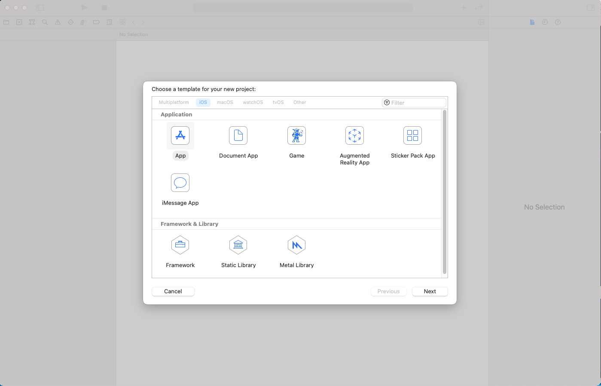
    <div style="color:orange; border-bottom: 1px solid #d9d9d9;
    display: inline-block;
    color: #999;
    padding: 2px;">空项目</div>
</center>
<center>
    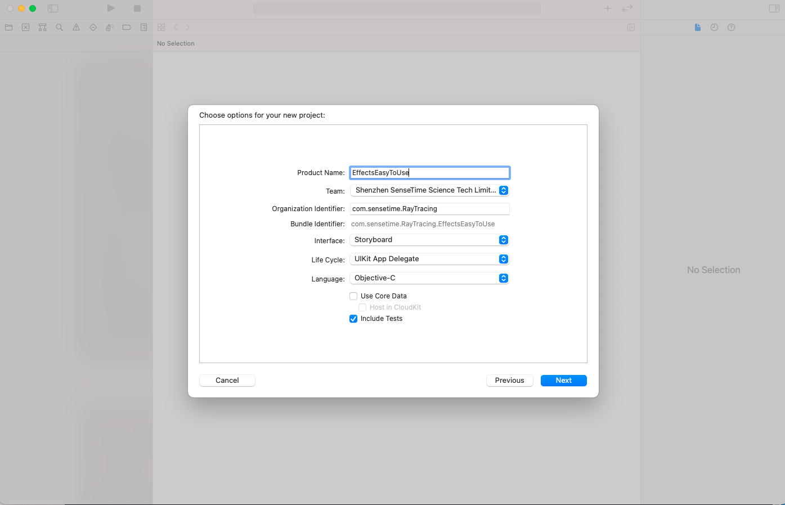
    <div style="color:orange; border-bottom: 1px solid #d9d9d9;
    display: inline-block;
    color: #999;
    padding: 2px;">项目命名</div>
</center>
#### 7.2 拷贝必要文件
##### 7.2.1 将Demo中的文件copy到自己的项目中
<center>
    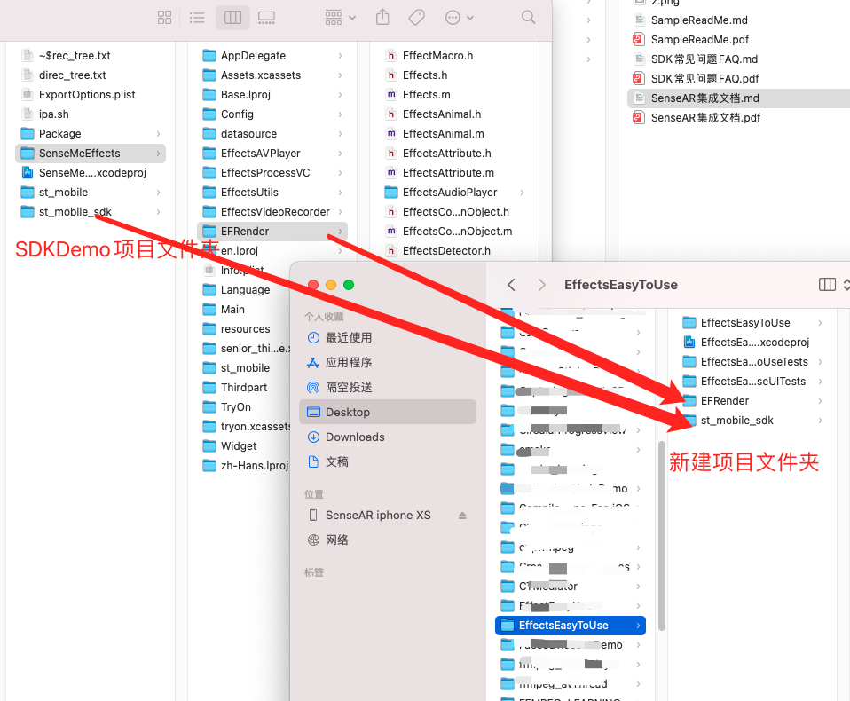
    <div style="color:orange; border-bottom: 1px solid #d9d9d9;
    display: inline-block;
    color: #999;
    padding: 2px;">复制文件</div>
</center>
<center>
    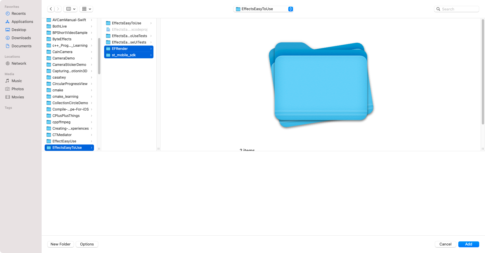
    <div style="color:orange; border-bottom: 1px solid #d9d9d9;
    display: inline-block;
    color: #999;
    padding: 2px;">复制文件2</div>
</center>
<center>
    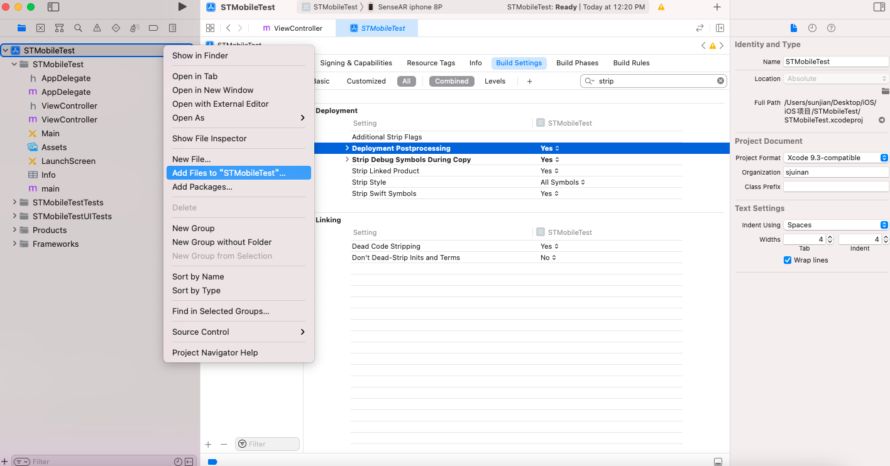
    <div style="color:orange; border-bottom: 1px solid #d9d9d9;
    display: inline-block;
    color: #999;
    padding: 2px;">添加文件到项目中</div>
</center>
<center>
    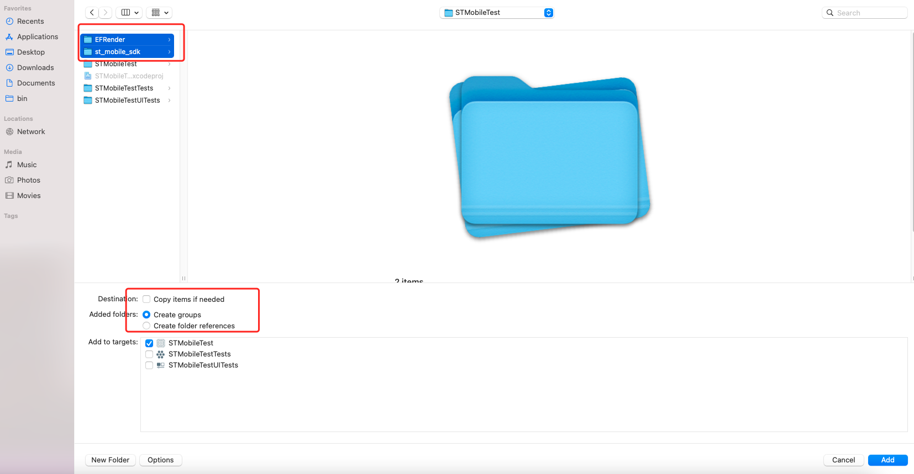
    <div style="color:orange; border-bottom: 1px solid #d9d9d9;
    display: inline-block;
    color: #999;
    padding: 2px;">添加文件到项目中</div>
</center>
<center>
    
    <div style="color:orange; border-bottom: 1px solid #d9d9d9;
    display: inline-block;
    color: #999;
    padding: 2px;">复制文件3</div>
</center>
#### 7.3 在项目中导入真机库和动态库
<center>
    
    <div style="color:orange; border-bottom: 1px solid #d9d9d9;
    display: inline-block;
    color: #999;
    padding: 2px;">st_mobile_sdk1</div>
</center>
<center>
    
    <div style="color:orange; border-bottom: 1px solid #d9d9d9;
    display: inline-block;
    color: #999;
    padding: 2px;">st_mobile_sdk1</div>
</center>

<center>
    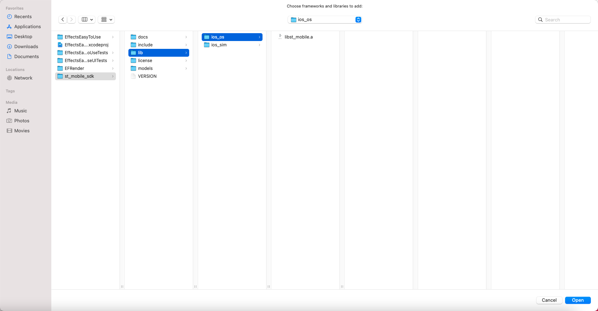
    <div style="color:orange; border-bottom: 1px solid #d9d9d9;
    display: inline-block;
    color: #999;
    padding: 2px;">st_mobile_sdk2</div>
</center>

<center>
    
    <div style="color:orange; border-bottom: 1px solid #d9d9d9;
    display: inline-block;
    color: #999;
    padding: 2px;">libc++</div>
</center>

<center>
    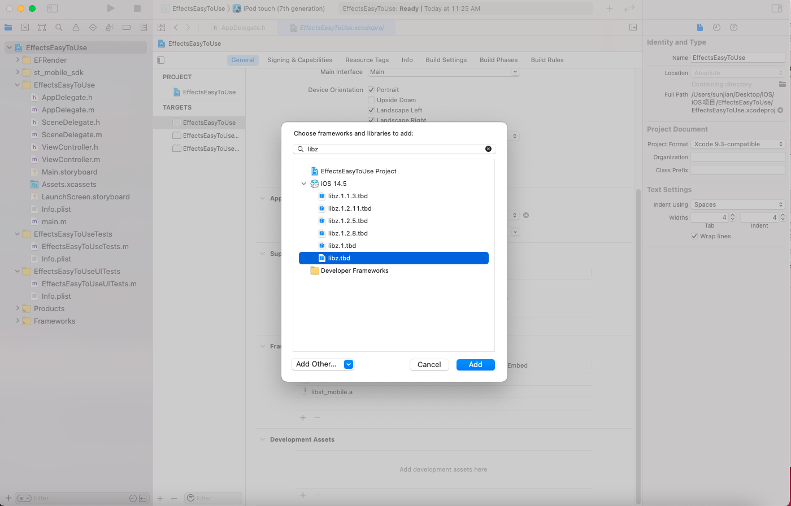
    <div style="color:orange; border-bottom: 1px solid #d9d9d9;
    display: inline-block;
    color: #999;
    padding: 2px;">libz</div>
</center>
将Enable BitCode设置为No
<center>
    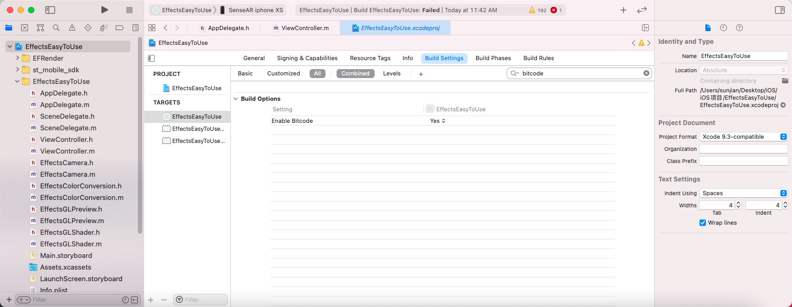
    <div style="color:orange; border-bottom: 1px solid #d9d9d9;
    display: inline-block;
    color: #999;
    padding: 2px;">关闭bitcode</div>
</center>
#### 7.4 导入辅助文件
这里导入的是相机和预览视图
<center>
    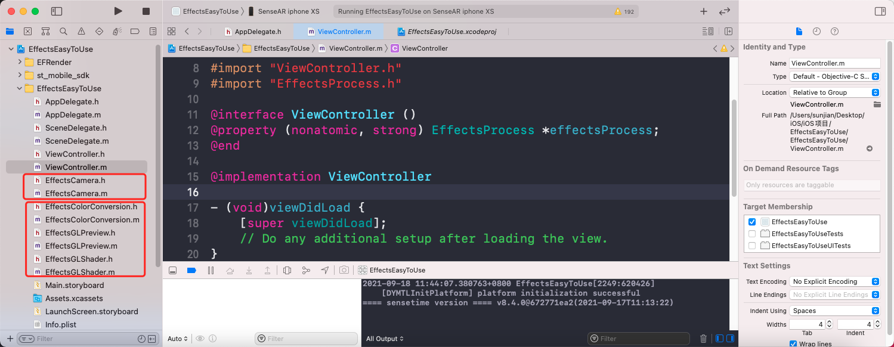
    <div style="color:orange; border-bottom: 1px solid #d9d9d9;
    display: inline-block;
    color: #999;
    padding: 2px;">导入辅助文件</div>
</center>
<center>
    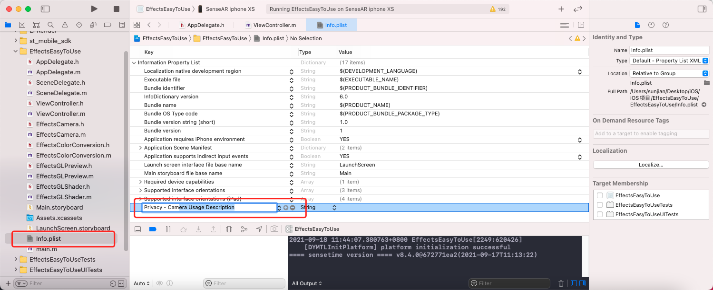
    <div style="color:orange; border-bottom: 1px solid #d9d9d9;
    display: inline-block;
    color: #999;
    padding: 2px;">开启相机使用权限请求</div>
</center>

#### 7.5开始集成
##### 7.5.1 导入头文件
<center>
    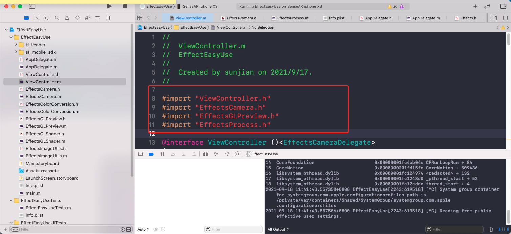
    <div style="color:orange; border-bottom: 1px solid #d9d9d9;
    display: inline-block;
    color: #999;
    padding: 2px;">import头文件</div>
</center>
##### 7.5.2 添加属性和成员变量
<center>
    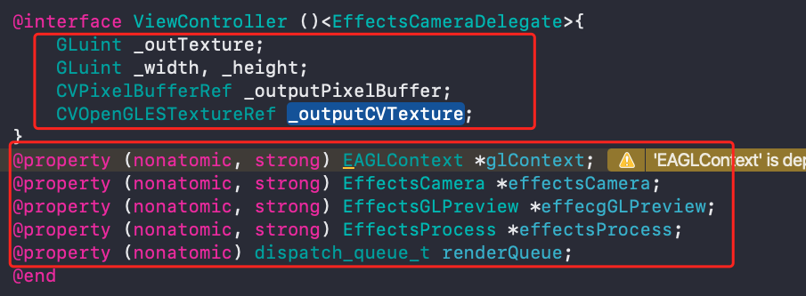
    <div style="color:orange; border-bottom: 1px solid #d9d9d9;
    display: inline-block;
    color: #999;
    padding: 2px;">添加属性和成员变量</div>
</center>
##### 7.5.3 对象初始化和调用流程
<center>
    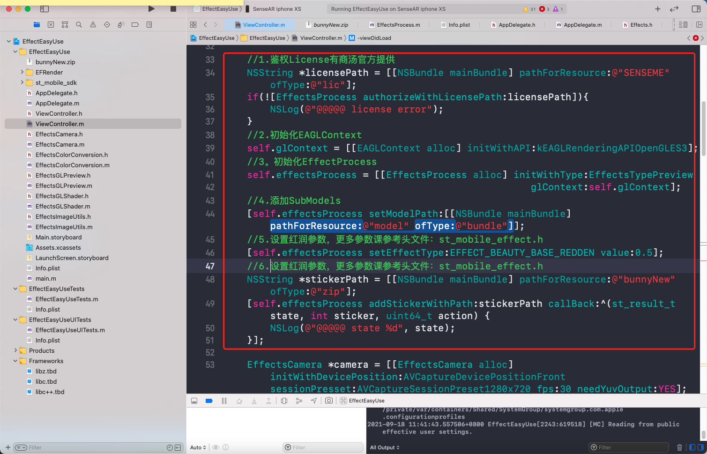
    <div style="color:orange; border-bottom: 1px solid #d9d9d9;
    display: inline-block;
    color: #999;
    padding: 2px;">初始化</div>
</center>
<center>
    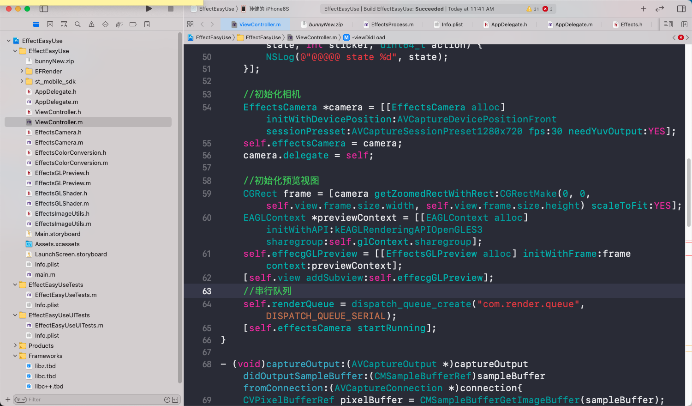
    <div style="color:orange; border-bottom: 1px solid #d9d9d9;
    display: inline-block;
    color: #999;
    padding: 2px;">初始化</div>
</center>
```
    //1.鉴权License有商汤官方提供
    //一定要先鉴权、一定要先鉴权、一定要先鉴权
    NSString *licensePath = [[NSBundle mainBundle] pathForResource:@"SENSEME" ofType:@"lic"];
    if(![EffectsProcess authorizeWithLicensePath:licensePath]){
        NSLog(@"@@@@@ license error");
    }
    //2.初始化EAGLContext
    self.glContext = [[EAGLContext alloc] initWithAPI:kEAGLRenderingAPIOpenGLES3];
    //3。初始化EffectProcess
    self.effectsProcess = [[EffectsProcess alloc] initWithType:EffectsTypePreview
                                                     glContext:self.glContext];
    //4.添加SubModels
    [self.effectsProcess setModelPath:[[NSBundle mainBundle] pathForResource:@"model" ofType:@"bundle"]];
    //5.设置红润参数，更多参数课参考头文件：st_mobile_effect.h
    [self.effectsProcess setEffectType:EFFECT_BEAUTY_BASE_REDDEN value:1.0];
    //6.添加素材
    NSString *stickerPath = [[NSBundle mainBundle] pathForResource:@"bunnyNew" ofType:@"zip"];
    [self.effectsProcess addStickerWithPath:stickerPath callBack:^(st_result_t state, int sticker, uint64_t action) {
        NSLog(@"@@@@@ state %d", state);
    }];
    
    //初始化相机
    EffectsCamera *camera = [[EffectsCamera alloc] initWithDevicePosition:AVCaptureDevicePositionFront sessionPresset:AVCaptureSessionPreset1280x720 fps:30 needYuvOutput:YES];
    self.effectsCamera = camera;
    camera.delegate = self;
    
    //初始化预览视图
    CGRect frame = [camera getZoomedRectWithRect:CGRectMake(0, 0, self.view.frame.size.width, self.view.frame.size.height) scaleToFit:YES];
    EAGLContext *previewContext = [[EAGLContext alloc] initWithAPI:kEAGLRenderingAPIOpenGLES3 sharegroup:self.glContext.sharegroup];
    self.effecgGLPreview = [[EffectsGLPreview alloc] initWithFrame:frame context:previewContext];
    [self.view addSubview:self.effecgGLPreview];
    //串行队列
    self.renderQueue = dispatch_queue_create("com.render.queue", DISPATCH_QUEUE_SERIAL);
    [self.effectsCamera startRunning];
```
##### 7.5.4 处理和渲染
```
- (void)captureOutput:(AVCaptureOutput *)captureOutput didOutputSampleBuffer:(CMSampleBufferRef)sampleBuffer fromConnection:(AVCaptureConnection *)connection{
    CVPixelBufferRef pixelBuffer = CMSampleBufferGetImageBuffer(sampleBuffer);
    CVPixelBufferLockBaseAddress(pixelBuffer, 0);
    
    //获取视频数据宽高
    int width = (int)CVPixelBufferGetWidth(pixelBuffer);
    int heigh = (int)CVPixelBufferGetHeight(pixelBuffer);
    
    //创建输出纹理
    if(!_outTexture || _width != width || _height != heigh){
        _width = width; _height = heigh;
        if(_outTexture) {
            CVPixelBufferRelease(_outputPixelBuffer);
            _outputPixelBuffer = NULL;
            CFRelease(_outputCVTexture);
            _outputCVTexture = 0;
        }
        
        [self.effectsProcess createGLObjectWith:width
                                         height:heigh
                                        texture:&_outTexture
                                    pixelBuffer:&_outputPixelBuffer
                                      cvTexture:&_outputCVTexture];
        
    }
    st_mobile_human_action_t detectResult;
    memset(&detectResult, 0, sizeof(st_mobile_human_action_t));
    st_mobile_animal_face_t *animalResult = NULL;
    int animalCount = 0;
    
    //人脸检测
    st_result_t ret = [self.effectsProcess detectWithPixelBuffer:pixelBuffer
                                                          rotate:ST_CLOCKWISE_ROTATE_0
                                                  cameraPosition:self.effectsCamera.devicePosition
                                                     humanAction:&detectResult
                                                    animalResult:&animalResult
                                                     animalCount:&animalCount];
    if (ret != ST_OK) {
        CVPixelBufferUnlockBaseAddress(pixelBuffer, 0);
        return;
    }
    
    st_mobile_human_action_t detectResultCopy;
    memset(&detectResultCopy, 0, sizeof(st_mobile_human_action_t));
    st_mobile_human_action_copy(&detectResult, &detectResultCopy);
    
    st_mobile_animal_face_t *animalResultCopy = NULL;
    int animalCountCopy = animalCount;
    if(animalResult != NULL){
        animalResultCopy = malloc(sizeof(st_mobile_animal_face_t) * animalCount);
        memset(animalResultCopy, 0, sizeof(st_mobile_animal_face_t) * animalCount);
        st_mobile_animal_face_copy(animalResult, animalCount, animalResultCopy, animalCountCopy);
    }
    
    CVPixelBufferRef pixelBufferCopy = CVPixelBufferRetain(pixelBuffer);
    dispatch_async(self.renderQueue, ^{
        
        //视频数据处理
        [self.effectsProcess renderPixelBuffer:pixelBufferCopy
                                        rotate:ST_CLOCKWISE_ROTATE_0
                                   humanAction:detectResultCopy
                                  animalResult:animalResultCopy
                                   animalCount:animalCountCopy
                                    outTexture:self->_outTexture
                                outPixelFormat:ST_PIX_FMT_BGRA8888
                                       outData:nil];
        
        //渲染
        [self.effecgGLPreview renderTexture:self->_outTexture rotate:-1];
        st_mobile_human_action_delete(&detectResultCopy);
        if (animalResultCopy)
            st_mobile_animal_face_delete(animalResultCopy, animalCountCopy);
        CVPixelBufferRelease(pixelBufferCopy);
        
    });
    CVPixelBufferUnlockBaseAddress(pixelBuffer, 0);
}
```
